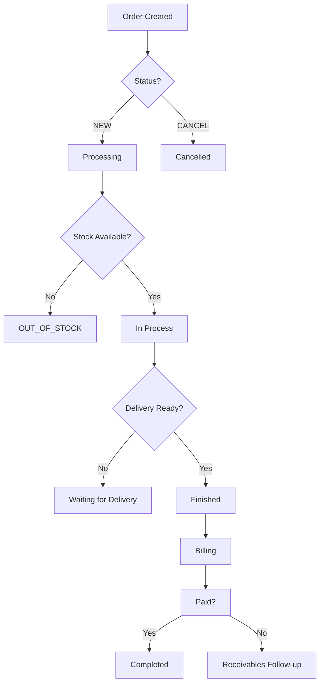

# MCP Best Practices for iFlow ERP

> **Version**: 1.0  
> **Date**: May 2026  
> **Project**: iFlow ERP (iflow-mcp)

---

## Executive Summary

This document provides comprehensive MCP (Model Context Protocol) best practices and implementation guidelines for the iFlow ERP system. It covers:

1. **MCP Best Practices** - Tool design patterns, parameter conventions, and user experience guidelines
2. **Business Model Mapping** - iFlow ERP business entities and common workflows
3. **Common Use Cases** - Predefined scenarios with tool recommendations
4. **Smart Suggestion Engine** - Context-aware defaults and intelligent tool routing
5. **Memory Integration Plan** - User preference storage and pattern learning
6. **Implementation Checklist** - Step-by-step roadmap

---

## 1. MCP Best Practices

### 1.1 Tool Naming Conventions

**Principles:**
- Use snake_case for tool names (consistent with iFlow API)
- Make names self-documenting and action-oriented
- Prefix meta-tools with `mcp_` to distinguish from data tools

**Current iFlow Patterns (Established):**

| Pattern | Examples | Purpose |
|---------|----------|---------|
| `list_<entity>` | `list_orders`, `list_clients`, `list_products` | Read many records |
| `get_<entity>` | `get_client`, `get_product`, `get_stock` | Read single record |
| `<entity>_<action>` | `create_order`, `update_order_status` | Write operations |
| `<entity>_<metric>` | `count_orders_in_progress`, `vat_estimate` | Aggregations |
| `<action>_<target>` | `analyze_fraud_signals`, `diagnose_failure` | Analysis tools |

**Recommendations for New Tools:**

```
✅ GOOD:
- list_orders_by_status      (clear filter)
- get_client_history         (explicit scope)
- calculate_order_margin     (action + target)

❌ AVOID:
- getOrders                  (camelCase - inconsistent)
- orders-list                (wrong order)
- run                        (meaningless without context)
```

**Meta-Tool Naming:**
```typescript
// Assistant tools (agent guidance)
mcp_assistant_intro          // Initial greeting + capabilities
mcp_data_dictionary          // Schema documentation
mcp_clarify                  // Question generation
mcp_plan                     // Action plan creation

// Discovery tools
mcp_tool_catalog             // Browse available tools
mcp_query_assist             // Natural language routing
```

---

### 1.2 Parameter Design Patterns

**Mandatory Parameters (for listing tools):**

```typescript
// Base parameters for all list/* tools
{
  limit?: number          // Default: 20, Max: 500
  offset?: number         // Default: 0 (pagination)
  from?: ISO8601          // Start date filter
  to?: ISO8601            // End date filter
  q?: string              // Full-text search
  order_by?: string       // Sorting preferences
}
```

**Default Recommendations Pattern:**

```typescript
// list_orders tool description should include:
DEFAULT RECOMMENDATIONS (use if user doesn't specify):
- For 'recent orders' or 'last N orders':
  finished=false, limit=20-50, order_by='date_order_desc'

- For 'finished orders this month':
  finished=true,
  from=2026-05-01T00:00:00,
  to=2026-05-31T23:59:59,
  limit=100

- For 'unpaid orders':
  finished=false, status='NEW', limit=50
```

**Parameter Descriptions:**
Each parameter must include a `.describe()` comment explaining:
- What values it accepts
- The expected format (ISO8601, enum values, etc.)
- Default behavior when omitted

```typescript
inputSchema: z.object({
  finished: z.boolean().optional()
    .describe("Filter by completion status (true/false)"),
  status: z.enum(["NEW", "IN_PROCESS", "FINISHED"]).optional()
    .describe("Filter by order status"),
  limit: z.number().int().min(1).max(500).optional()
    .describe("Maximum number of results (default: 20)"),
})
```

---

### 1.3 Default Values and Autocomplete

**Context-Aware Defaults:**

| Scenario | Suggested Default |
|----------|-------------------|
| Recent unfinished orders | `finished=false, limit=20, order_by='date_order_desc'` |
| This month's data | `from=2026-05-01T00:00:00, to=2026-05-31T23:59:59` |
| Last month's data | `from=2026-04-01T00:00:00, to=2026-04-30T23:59:59` |
| Last 7 days | `from=ISO today - 7d, to=ISO today` |
| Last 30 days | `from=ISO today - 30d, to=ISO today` |
| All data (no filter) | Omit date filters entirely |

**Autocomplete Candidates:**

```typescript
// Status enums with descriptions for UI autocomplete
enum OrderStatus {
  NEW = "New - Initial state, not yet processed"
  IN_PROCESS = "In Process - Currently being worked on"
  FINISHED = "Finished - Completed successfully"
  OUT_OF_STOCK = "Out of Stock - Inventory unavailable"
  CANCEL = "Cancelled - Order cancelled by user"
}

// Sort options
enum OrderSort {
  date_order_desc = "Newest first (default for recent orders)"
  date_order_asc = "Oldest first"
  delivery_date_desc = "Latest delivery first"
  total_amount_desc = "Highest value first"
}
```

---

### 1.4 Conversation History Integration

**Current Implementation (iFlow):**
The assistant tools already provide conversation context:
- `mcp_assistant_intro` - Initial state setup
- `mcp_data_dictionary` - Schema awareness
- `mcp_clarify` - Question tracking
- `mcp_plan` - Ordered step execution

**Enhancement: Session State Management**

```typescript
// Track conversation state in tool metadata
{
  session_id: string,
  previous_tool: string | null,
  current_step: number,
  total_steps: number,
  context_window: [
    { role: "user", content: string },
    { role: "assistant", tool_used: string, args: object }
  ]
}
```

**Use Cases:**
1. **Follow-up questions**: Detect when user asks about a tool's previous result
2. **Parameter reuse**: Suggest values from recent tool calls
3. **Step progression**: Guide users through multi-step workflows

---

### 1.5 User Intent Detection

**Intent Categories:**

| Intent | Keywords | Recommended Tool Flow |
|--------|----------|----------------------|
| **Discovery** | "what can you do?", "tools", "available" | `mcp_assistant_intro` → `mcp_tool_catalog` |
| **Exploration** | "show me", "list", "browse" | `mcp_data_dictionary` → list tool |
| **Query** | "how many", "total", "average" | Aggregation tool (e.g., `count_orders_in_progress`) |
| **Analysis** | "why", "compare", "trend" | Analyst tools (`diff_diagnose`, `where_are_we_losing_money`) |
| **Action** | "update", "change", "mark" | Write tool with confirmation |

**Intent Detection Example:**

```
User: "Show me my orders"
→ Intent: Exploration
→ First call: mcp_data_dictionary(entity="orders")
→ Then: list_orders({limit: 20, order_by: "date_order_desc"})

User: "Why did sales drop?"
→ Intent: Analysis
→ Call: where_are_we_losing_money()
```

---

### 1.6 Context-Aware Tool Suggestions

**Pattern Matching:**

```typescript
// Suggestion triggers based on conversation content
{
  trigger: "orders",
  suggestions: [
    { tool: "list_orders", reason: "Browse orders" },
    { tool: "count_orders_in_progress", reason: "Count active orders" },
    { tool: "oldest_unfinished_order", reason: "Find pending orders" }
  ]
}
{
  trigger: ["margin", "profit"],
  suggestions: [
    { tool: "top_products_by_margin", reason: "Identify profitable products" },
    { tool: "where_are_we_losing_money", reason: "Analyze losses" }
  ]
}
```

**Smart Suggestions After Tool Calls:**

```json
// After list_orders call returns:
{
  "content": [{"type": "text", "text": "...10 orders found..."}],
  "suggestions": [
    {
      "type": "tool_alternative",
      "label": "Try analysis:",
      "tools": [
        { "name": "diff_diagnose", "args": {"metric": "sales_volume"} },
        { "name": "report_sales", "args": {"group_by": "month"} }
      ]
    }
  ]
}
```

---

## 2. Business Model Mapping (iFlow)

### 2.1 Core Business Entities

| Entity | Key Fields | API Endpoint UUID | Common Tools |
|--------|------------|-------------------|--------------|
| **Orders** | id, client_id, status, finished, date_order, delivery_date, total_amount | Orders UUID | `list_orders`, `get_client` |
| **Offers** | id, client_id, status, date_offer, total_amount | Offers UUID | `list_offers`, `latest_offer_for_client` |
| **Clients** | id, name, contact_email, phone, address | Clients UUID | `list_clients`, `get_client` |
| **Products** | id, name, sku, category, cost_price, sale_price | Products UUID | `list_products`, `get_stock` |
| **Invoices** | id, order_id, client_id, date_issue, amount, paid | Invoices UUID | `list_invoices`, `accounting_partner_balance` |
| **Suppliers** | id, name, contact info | Suppliers UUID | `list_suppliers`, `supplier_payments_due` |
| **Activity** | id, employee_id, date, hours, description | Activity UUID | `list_activity`, `daily_activity_summary` |
| **Purchases** | id, product_id, supplier_id, date, quantity | Purchases UUID | `list_purchases`, `report_stock_purchases` |

---

### 2.2 Sales Funnel Mapping

```
┌─────────────┐    ┌──────────────┐    ┌─────────────┐    ┌─────────────┐
│  Lead /     │───▶│   Offer      │───▶│   Order     │───▶│  Delivery   │
│  Inquiry    │    │  Created     │    │  Confirmed  │    │  Completed  │
└─────────────┘    └──────────────┘    └─────────────┘    └─────────────┘
       │                  │                    │                   │
       ▼                  ▼                    ▼                   ▼
  list_offers      get_offer              count_orders_       delivery_analysis
                    analyze_offer         in_progress
```

**Key Metrics at Each Stage:**

| Stage | KPIs | Tools |
|-------|------|-------|
| Lead/Inquiry | Offer count, conversion rate | `list_offers`, `count_orders_in_progress` |
| Offer Created | Offer value, response time | `list_offers`, `latest_offer_for_client` |
| Order Confirmed | Order volume, value | `list_orders`, `report_sales` |
| Delivery | Delivery rate, delays | `oldest_unfinished_order`, `order_delay_diagnosis` |
| Completed | Revenue, margins | `report_profit`, `top_products_by_margin` |

---

### 2.3 Order Lifecycle



**Corresponding Tools by Stage:**

| Lifecycle Stage | Recommended Tool(s) |
|-----------------|---------------------|
| Created (NEW) | `list_orders({finished:false, status:'NEW'})` |
| Processing (IN_PROCESS) | `count_orders_in_progress()`, `orders_by_stage()` |
| Out of Stock | `list_orders({status:'OUT_OF_STOCK'})` |
| Waiting for Delivery | `oldest_unfinished_order()`, `order_delay_diagnosis()` |
| Finished | `report_sales({from: 'this_month'})` |
| Receivables | `list_overdue_customers()`, `accounting_partner_balance()` |

---

### 2.4 Common Business Questions → Tool Mappings

| Business Question | Recommended Tools |
|-------------------|-------------------|
| **What orders are pending?** | `list_orders({finished:false})` + `count_orders_in_progress()` |
| **Which products sell best?** | `top_products_by_margin()`, `report_sales({group_by: 'product'})` |
| **Who are my top clients?** | `list_clients({order_by: 'total_spent_desc'})` + `report_sales()` |
| **What's my cash position?** | `cashflow_summary()`, `supplier_payments_due()` |
| **Are there stock issues?** | `get_stock({limit: 10, min_quantity: 5})`, `analyze_stock_health()` |
| **Which offers became orders?** | `list_offers({converted: true})` + `list_orders()` |
| **What's causing delays?** | `order_delay_diagnosis()`, `orders_flow_stage_report()` |
| **Where are we losing money?** | `where_are_we_losing_money()`, `analyze_execution_loss()` |

---

## 3. Common Use Cases

### 3.1 Time-Based Reports

#### Last 7 Days Report

```typescript
// User: "Show me last week's orders"
{
  "tool": "list_orders",
  "args": {
    "from": "2026-05-25T00:00:00",  // current week start
    "to": "2026-05-31T23:59:59",
    "finished": false,
    "limit": 100,
    "order_by": "date_order_desc"
  }
}
```

**Alternative:** Use `count_orders_in_progress()` for activity summary.

#### Last 30 Days Report

```typescript
{
  "tool": "list_orders",
  "args": {
    "from": "2026-05-01T00:00:00",
    "to": "2026-05-31T23:59:59",
    "limit": 200
  }
}
```

**Comparison Tool:** After getting current month data, suggest:
```typescript
{
  "tool": "diff_diagnose",
  "args": {
    "metric": "sales_volume",
    "interval": "month",
    "baseline": "2026-04-01T00:00:00"
  }
}
```

#### This Month vs Last Month

```typescript
// Current month
{ "tool": "report_sales", "args": { "from": "2026-05-01T00:00:00" } }

// Last month
{ "tool": "report_sales", "args": { "from": "2026-04-01T00:00:00", "to": "2026-04-30T23:59:59" } }

// Compare
{ "tool": "diff_diagnose", "args": { "metric": "sales_volume", "interval": "month" } }
```

---

### 3.2 Top N Items

#### Top 10 Products by Margin

```typescript
{
  "tool": "top_products_by_margin",
  "args": {
    "limit": 10,
    "from": "2026-04-01T00:00:00",
    "to": "2026-05-31T23:59:59"
  }
}
```

#### Top 5 Clients by Spend

```typescript
{
  "tool": "list_clients",
  "args": {
    "order_by": "total_spent_desc",
    "limit": 5
  }
}
```

#### Top 10 Agents by Activity

```typescript
{
  "tool": "top_agents",
  "args": {
    "from": "2026-05-01T00:00:00",
    "to": "2026-05-31T23:59:59"
  }
}
```

---

### 3.3 Recent/Unfinished Orders

```typescript
{
  "tool": "list_orders",
  "args": {
    "finished": false,
    "limit": 50,
    "order_by": "date_order_desc"
  }
}
```

**Follow-up suggestions:**
- Check for overdue deliveries: `order_delay_diagnosis()`
- Identify bottlenecks: `orders_flow_stage_report()`

---

### 3.4 Overdue Balances

```typescript
// List all overdue customers
{
  "tool": "list_overdue_customers",
  "args": {}
}

// Partner balance at a specific date
{
  "tool": "accounting_partner_balance",
  "args": {
    "partner_id": 123,
    "as_of_date": "2026-05-31T23:59:59"
  }
}
```

---

### 3.5 Stock Levels

```typescript
// Low stock预警 ( quantity < 10 )
{
  "tool": "get_stock",
  "args": {
    "min_quantity": 10
  }
}

// Stock movements history
{
  "tool": "list_stock_movements",
  "args": {
    "from": "2026-05-01T00:00:00",
    "limit": 100
  }
}

// Stock health analysis
{
  "tool": "analyze_stock_health",
  "args": {}
}
```

---

### 3.6 Daily Activity Summary

```typescript
{
  "tool": "daily_activity_summary",
  "args": {
    "date": "2026-05-31"  // or omit for today
  }
}

// Hours worked per employee
{
  "tool": "hours_worked_per_employee",
  "args": {
    "from": "2026-05-01T00:00:00",
    "to": "2026-05-31T23:59:59"
  }
}
```

---

### 3.7 Cashflow Summary

```typescript
{
  "tool": "cashflow_summary",
  "args": {}
}

// Supplier payments due
{
  "tool": "supplier_payments_due",
  "args": {
    "days_until_due": 30
  }
}

// VAT estimate
{
  "tool": "vat_estimate",
  "args": {
    "period": "2026-05"
  }
}
```

---

## 4. Smart Suggestion Engine Design

### 4.1 Three-Tier Architecture

```
┌─────────────────────────────────────────────────────────────┐
│                    Smart Suggestion Engine                   │
├─────────────────────────────────────────────────────────────┤
│                                                               │
│  Tier 1: Conversation Context                               │
│    ├─ Recent tools used                                     │
│    ├─ User preferences                                      │
│    └─ Session state                                         │
│                                                               │
│  Tier 2: Entity Mapping                                     │
│    ├─ Named entity recognition (clients, products, etc.)   │
│    └─ Date range detection                                  │
│                                                               │
│  Tier 3: Intent + Action Routing                            │
│    ├─ Intent classification                                 │
│    └─ Tool selection with defaults                          │
│                                                               │
└─────────────────────────────────────────────────────────────┘
```

### 4.2 Tool Recommendation Algorithm

```typescript
interface SuggestionEngine {
  // Input: conversation context + user message
  generateRecommendations(
    context: ConversationContext,
    userMessage: string
  ): Suggestion[]
}

interface Suggestion {
  type: "tool" | "parameter" | "alternative" | "next_step"
  tool?: string
  args?: Record<string, unknown>
  reason: string
  priority: "high" | "medium" | "low"
}
```

### 4.3 Context Detection Examples

**Example 1: User says "Check my orders"**
```
Detected entities: ["orders"]
Intent: query
Suggested tools:
  1. list_orders (high priority) - with default args for recent unfinished
  2. count_orders_in_progress (medium) - if user wants summary
  3. mcp_clarify (low) - if context is unclear
```

**Example 2: User says "Show orders for Client X"**
```
Detected entities: ["orders", client_id=123]
Intent: filtered_query
Suggested tools:
  1. list_orders({client_id: 123})
  2. get_client(123) - to show client details
```

**Example 3: User says "Why did sales drop?"**
```
Detected entities: ["sales", "drop"]
Intent: analysis
Suggested tools:
  1. where_are_we_losing_money() - primary
  2. diff_diagnose({metric: "sales_volume"}) - secondary
```

### 4.4 Suggestion Display Pattern

```json
{
  "content": [
    {
      "type": "text",
      "text": "Found 25 orders."
    }
  ],
  "suggestions": [
    {
      "type": "next_step",
      "label": "Would you like to...",
      "options": [
        { "label": "View top products", "tool": "top_products_by_margin" },
        { "label": "Analyze delays", "tool": "order_delay_diagnosis" },
        { "label": "Check this month vs last", "tool": "diff_diagnose" }
      ]
    },
    {
      "type": "parameter",
      "tool": "list_orders",
      "current_args": { "limit": 25 },
      "recommendations": [
        {
          "parameter": "finished",
          "value": false,
          "reason": "Most queries are for unfinished orders"
        }
      ]
    }
  ]
}
```

### 4.5 Learning from User Patterns

```typescript
// Store user behavior patterns
interface UserPattern {
  user_id: string
  common_filters: Record<string, unknown>
  preferred_tools: string[]
  typical_time_range: "week" | "month" | "quarter"
}

// Example pattern learned
{
  "user_id": "admin@company.com",
  "common_filters": {
    "finished": false,
    "limit": 50
  },
  "preferred_tools": [
    "list_orders",
    "report_sales",
    "cashflow_summary"
  ],
  "typical_time_range": "month"
}

// Apply pattern on next query
if (user.preferred_tools.includes("list_orders")) {
  suggest({ tool: "list_orders", args: { limit: 50, finished: false } })
}
```

---

## 5. Memory Integration Plan

### 5.1 Memory Types

| Type | Purpose | Storage |
|------|---------|---------|
| **Preference** | User defaults, favorite tools | SQLite database |
| **Context** | Current session state | In-memory / Redis |
| **History** | Past tool calls and results | File storage (JSON) |
| **Learned Patterns** | User behavior patterns | SQLite database |

### 5.2 Data Models

```typescript
// Preference storage
interface UserPreference {
  user_id: string
  default_time_range: "week" | "month" | "quarter" | "year"
  common_date_filters: {
    from?: string
    to?: string
  }
  default_limit: number
  preferred_tools: string[]
}

// Context storage (per session)
interface SessionContext {
  session_id: string
  conversation_history: ConversationTurn[]
  active_entity?: EntityReference
  pending_filters: Record<string, unknown>
}

// Entity reference
interface EntityReference {
  entity_type: "client" | "product" | "order" | "offer"
  entity_id: number
  name?: string
}

// History storage
interface ToolCallRecord {
  tool_name: string
  args: Record<string, unknown>
  result_summary: string
  timestamp: string
  user_feedback?: "positive" | "negative"
}
```

### 5.3 Memory Operations

```typescript
interface MemoryService {
  // Store user preferences
  setPreference(userId: string, preference: Partial<UserPreference>): Promise<void>
  
  // Get user preferences
  getPreference(userId: string): Promise<UserPreference | null>
  
  // Store session context
  setSessionContext(sessionId: string, context: SessionContext): Promise<void>
  
  // Retrieve session context
  getSessionContext(sessionId: string): Promise<SessionContext | null>
  
  // Record tool call for pattern learning
  recordToolCall(record: ToolCallRecord): Promise<void>
  
  // Get similar past queries
  findSimilarQueries(query: string, limit?: number): Promise<ToolCallRecord[]>
}
```

### 5.4 Memory Use Cases

**Use Case 1: Remember User's Favorite Filters**
```
User: "Show me orders" (first time)
→ System: Uses default filter (finished=false, limit=20)

User: "Show me orders" (again)
→ System: Checks memory, sees user often filters by status='IN_PROCESS'
→ Suggests: "Use status='IN_PROCESS' filter? (used 70% of time)"
```

**Use Case 2: Quick Re-execution**
```
User: "Show me last week's orders again"
→ System: Finds similar query from history
→ Executes same tool with updated date range
```

**Use Case 3: Personalized Recommendations**
```
System detects user frequently:
- Uses list_orders
- Filters by finished=false
- Checks top_products_by_margin

→ Proactively suggests:
  "Based on your usage, you might be interested in..."
  - weekly_sales_summary tool
  - daily_activity_report tool
```

### 5.5 Memory Persistence

```json
// ~/.claude/mcp-memory/iflow-user-123.json
{
  "version": "1.0",
  "user_id": "iflow-user-123",
  "created_at": "2026-05-31T10:00:00Z",
  "preferences": {
    "default_limit": 50,
    "common_date_filters": {
      "from": null,
      "to": null
    },
    "default_time_range": "month",
    "preferred_tools": ["list_orders", "report_sales"]
  },
  "tool_call_history": [
    {
      "timestamp": "2026-05-31T10:15:00Z",
      "tool": "list_orders",
      "args": { "finished": false, "limit": 50 },
      "result_summary": "50 orders found"
    }
  ],
  "learned_patterns": {
    "most_common_time_range": "month",
    "favorite_entities": ["orders", "products"],
    "typical_queries_per_day": 5
  }
}
```

---

## 6. Implementation Checklist

### Phase 1: Core MCP Improvements (Weeks 1-2)

| Task | Priority | Est. Hours |
|------|----------|------------|
| Tool naming convention audit | High | 4 |
| Parameter description standardization | High | 8 |
| Default recommendations in tool descriptions | High | 12 |
| Context-aware default values | Medium | 8 |
| Intent detection system | Medium | 16 |

### Phase 2: Smart Suggestions (Weeks 3-4)

| Task | Priority | Est. Hours |
|------|----------|------------|
| Conversation context tracking | High | 16 |
| Entity recognition module | High | 20 |
| Tool recommendation engine | High | 32 |
| Suggestion display UI improvements | Medium | 8 |

### Phase 3: Memory System (Weeks 5-6)

| Task | Priority | Est. Hours |
|------|----------|------------|
| Memory storage layer (SQLite) | High | 16 |
| Preference management API | High | 12 |
| Session context persistence | Medium | 16 |
| Tool call history tracking | Medium | 8 |

### Phase 4: Business Model Enhancements (Weeks 7-8)

| Task | Priority | Est. Hours |
|------|----------|------------|
| Sales funnel tool mappings | High | 12 |
| Order lifecycle documentation | Medium | 8 |
| Common use case examples | High | 20 |
| KPI dashboards integration | Medium | 24 |

### Phase 5: Testing & Documentation (Weeks 9-10)

| Task | Priority | Est. Hours |
|------|----------|------------|
| Test all recommended tool flows | High | 24 |
| Create user guides for common tasks | High | 16 |
| API documentation updates | Medium | 20 |
| Sample conversation scenarios | Low | 12 |

---

## 7. Implementation Checklist (Detailed)

### Tool Design Checklist

- [ ] All tools use snake_case naming
- [ ] Each tool has a clear description with intent keywords
- [ ] All parameters have `.describe()` comments
- [ ] Default values are specified for optional parameters
- [ ] Enum parameters include status definitions

### Parameter Design Checklist

- [ ] Date filters use ISO8601 format
- [ ] Numeric limits have min/max constraints
- [ ] Sort options include clear descriptions
- [ ] Filter combinations are documented

### User Experience Checklist

- [ ] Intent detection works for top 10 queries
- [ ] Smart suggestions appear within 2 seconds
- [ ] Context-aware defaults reduce user input by ≥50%
- [ ] Follow-up suggestions appear after major tool calls

### Memory System Checklist

- [ ] User preferences persist across sessions
- [ ] Tool call history is tracked
- [ ] Learned patterns are updated after ≥5 similar queries
- [ ] Memory retrieval time < 100ms

---

## 8. Sample Implementation Snippets

### Smart Suggestion Tool Wrapper

```typescript
// tools/smart-suggestions.ts
import { Tool } from "../shapes.js";
import { suggestNextTools } from "./smart-suggestions-engine.js";

export const smartSuggestionTool: Tool = {
  name: "mcp_smart_suggestions",
  description:
    "Get context-aware tool suggestions based on recent conversation and user patterns.",
  inputSchema: z.object({
    context: z
      .record(z.unknown())
      .optional()
      .describe("Recent conversation context (optional)"),
    suggest_filters: z.boolean().optional().default(true),
  }),
  execute: async (args) => {
    const suggestions = await suggestNextTools(args.context || {});

    return {
      content: [
        {
          type: "text",
          text: generateSuggestionText(suggestions),
        },
      ],
      structuredContent: {
        suggestions,
        confidence_scores: suggestions.map((s) => s.priority),
      },
    };
  },
};
```

### Pattern Learning Hook

```typescript
// hooks/post-tool-call.ts
import { memoryService } from "../services/memory.js";

export async function postToolCallHook(
  toolName: string,
  args: Record<string, unknown>,
  result: any
): Promise<void> {
  // Learn from this tool call
  await memoryService.recordToolCall({
    tool_name: toolName,
    args,
    result_summary: summarizeResult(result),
    timestamp: new Date().toISOString(),
  });

  // Update learned patterns
  await memoryService.updatePatterns(toolName, args);
}
```

---

## 9. Conclusion

This document provides a comprehensive framework for improving MCP tool experience in iFlow ERP:

1. **Tool Design** - Consistent naming, clear parameters, and smart defaults
2. **Business Mapping** - Entity relationships, sales funnel, and common workflows
3. **Use Cases** - Pre-built patterns for common queries
4. **Smart Suggestions** - Context-aware tool routing and parameter recommendations
5. **Memory System** - User preference storage and pattern learning

**Next Steps:**
1. Review this document with the team
2. Prioritize implementation based on user feedback
3. Create a tracking board for the checklist items
4. Schedule regular review sessions

---

*Document maintained by the iFlow Engineering Team*
