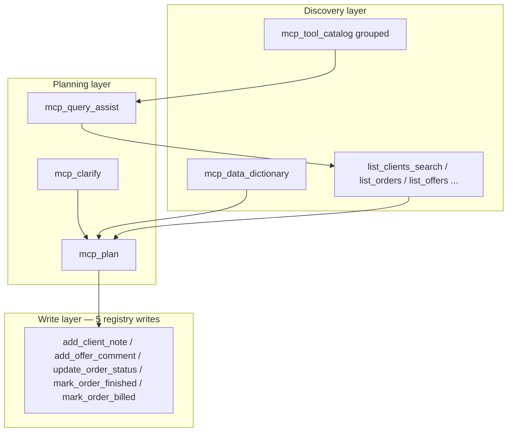

# iFlows personal assistant — grouped discovery + dependency-aware writes

> **For agentic workers:** REQUIRED SUB-SKILL: Use superpowers:subagent-driven-development (recommended) or superpowers:executing-plans to implement this plan task-by-task. Steps use checkbox (`- [ ]`) syntax for tracking.
>
> Workspace copy: `.plans/iflows-personal-assistant.plan.md`. Cursor may still open the plan UI from `canonical_cursor_plan` in the YAML frontmatter.

**Goal:** Give the host LLM one grouped catalog call that mirrors the integration-page cards, plus a declared write→discovery dependency graph so it resolves entity IDs (via list/search) before calling write tools — without inventing IDs.

**Architecture:** All intelligence stays in **broker metadata + Cursor rules + host model** (MCP is the port, not the orchestrator). Django remains the source of truth for groups (`_GROUPS`) and now for tool prerequisites (`_TOOL_PREREQUISITES`); the catalog snapshot surfaces both; iflow-mcp forwards new query params unchanged; a Cursor rule + optional MCP prompt encode the `iflows` behavior contract. Dependencies are **advisory** (no server-side enforcement in v1).

**Tech Stack:** Django 4.2 / Python 3.8 (api_external MCP services), TypeScript MCP server (`iflow-mcp`, vitest), Cursor rules (`.mdc`).

---

## Code review (corrections applied to the original plan)

A read-through of the live code surfaced several inaccuracies in the first draft. The tasks below are built on the corrected facts.

1. **`create_order` is NOT a Django registry tool.** It exists only as an iflow-mcp TS tool (`iflow-mcp/src/tools/lookup/write.ts`) and as a dead `_TOOL_CATEGORIES["create_order"] = "write"` entry in `mcp_endpoints.py:3841`. It is absent from `get_merged_registry()` (only **5** writes are registered — see below), from `_GROUPS`, and from `_INPUT_PARAM_SPECS`; it has no handler. → The dependency matrix, query-assist rules, and "every write has prerequisites" assertion must target the **5 real registry writes**, and `create_order` is documented as a cross-repo special case only.

2. **The 5 real registry writes** (from `mcp_registry.py` `_INPUT_PARAM_SPECS` + registry builder) and their required IDs:
   - `update_order_status` — `order_id`(req), `status`(req), `note`
   - `mark_order_finished` — `order_id`(req), `finish_date`
   - `mark_order_billed` — `order_id`(req), `billing_status`(req)
   - `add_client_note` — `client_id`(req), `subject`(req), `text`, `note_type_id`, `reminder_date`
   - `add_offer_comment` — `offer_id`(req), `text`(req), `subject`, `comment_action_id`

3. **Symbol homes (verified):** `_GROUPS`, `_INPUT_PARAM_SPECS`, `McpToolParamInfo`, `get_mcp_tool_list`, `is_mcp_write_endpoint`, `endpoint_requires_confirmation_effective` live in **`mcp_registry.py`**. `_TOOL_CATEGORIES` (line 3765), `_QUERY_ASSIST_RULES` (line 3859), `_registry_snapshot` (line 3995), `handle_mcp_tool_catalog` (line 4031), `handle_mcp_query_assist` (line 4053) live in **`mcp_endpoints.py`**. So adding `group` to the snapshot means importing a helper **from `mcp_registry` into `mcp_endpoints`** (the snapshot already lazy-imports from registry — extend that import).

4. **`_registry_snapshot` exposes `category`, not `group`.** Confirmed (`mcp_endpoints.py:4013`). It uses raw `bool(req)` for `requires_confirmation`, whereas the UI list uses `endpoint_requires_confirmation_effective(...)` (honors `IFLOW_MCP_FORCE_CONFIRMATION_KEYS` and per-key overrides). The "write has prerequisites" assertion should therefore key off the **known 5 writes / `is_mcp_write_endpoint`**, not the raw flag.

5. **`mcp_query_assist` has no write-intent rules today.** The existing `"note client"` rule (`mcp_endpoints.py:3959`) maps to **read** tools (`list_notes`, `list_comments`). The matcher (`handle_mcp_query_assist`, line 4072) iterates rules in tuple order, appends recommendations, and **dedups globally by tool key, preserving first-seen order**. Consequence: to guarantee "discovery-before-write", a write rule must list its discovery tools **first within its own reco tuple**, and must use **distinct keywords** from the existing read rule (e.g. `"adauga nota"`, `"add note"`) so it is not shadowed by the earlier read rule's dedup.

6. **`format=grouped` ordering already has a canonical source:** `_group_order()` (`mcp_registry.py:1146`) defines the stable 6-group order. Reuse it instead of re-hardcoding.

7. **Tests that must change:** `prompts-resources.test.ts` asserts **exactly 3** prompts (line 13) — adding an `iflows` prompt requires bumping to 4 + name/content asserts. `new-listings.test.ts` asserts `category=list` forwarding for `mcp_tool_catalog` (line 143) — extend for `group`/`format`. `test_mcp_registry.py` (Django) is the natural home for group/prereq assertions. `npm run check:mcp-contract` is Django→TS, so adding a `group` field (no new keys) is safe; a new TS-only tool would also pass.

8. **Latent issues spotted (out of scope, noted):** `_QUERY_ASSIST_RULES` line 3971 `("profit")` is a string, not a tuple — works only by the `isinstance(..., tuple)` fallback. `_group_order()` returns duplicate tuples (dedup happens in the dict-comp consumer). Leave both unless touched.

## Current state (verified)

- **Host UI groups** (Business Operations, Partners & Communications, Analytics & Reports, Analysis & Diagnostics, Meta & Discovery, Write Actions) are defined in [`_GROUPS`](iflow01/myintranet/api_external/services/mcp_registry.py) (line 136) and drive the integration cards via [`get_mcp_tool_list`](iflow01/myintranet/api_external/services/mcp_registry.py) (line 1159). Stable order from `_group_order()` (line 1146).
- **Broker catalog** [`handle_mcp_tool_catalog`](iflow01/myintranet/api_external/services/mcp_endpoints.py) (4031) / [`_registry_snapshot`](iflow01/myintranet/api_external/services/mcp_endpoints.py) (3995) returns per-tool rows with logical **`category`** (from [`_TOOL_CATEGORIES`](iflow01/myintranet/api_external/services/mcp_endpoints.py) line 3765) — **not** the UI group label. The model cannot reproduce the card grouping from catalog JSON alone.
- **Discovery stack exists**: `mcp_tool_catalog`, `mcp_query_assist`, `mcp_assistant_intro`, `mcp_data_dictionary`, `mcp_clarify`, `mcp_plan` ([`iflow-mcp/src/tools/assistant/index.ts`](iflow-mcp/src/tools/assistant/index.ts), [`iflow-mcp/src/tools/lookup/catalog.ts`](iflow-mcp/src/tools/lookup/catalog.ts)). The catalog TS tool forwards `category` + `q` only.
- **MCP prompts** in [`iflow-mcp/src/mcp-server-factory.ts`](iflow-mcp/src/mcp-server-factory.ts) are three fixed templates (`new-order`, `daily-report`, `find-problems`); [`prompts-resources.test.ts`](iflow-mcp/test/prompts-resources.test.ts) asserts count/names.
- **Cursor rule** [`.cursor/rules/iflow-mcp-aggressive-priority.mdc`](.cursor/rules/iflow-mcp-aggressive-priority.mdc) (`alwaysApply: true`) already steers the model to MCP-first; it has a thin "writes only if explicitly requested" clause but no prerequisite-discovery contract.

## Phase 0 — Business domain matrix (committed artifact, before code)

Goal: **one coherent, committed model** of how the 5 writes chain to discovery, so dependency fields are not guessed from names. Output is a real file the code references in review, not a throwaway note.

The matrix (built in Task 1) maps **write tool → required params → recommended prior discovery tools → optional clarifications**, e.g.:

| Write | Required IDs | Resolve via (ordered) | Optional / enum source |
|---|---|---|---|
| `add_client_note` | `client_id` | `list_clients_search` → `get_client` | `note_type_id` via `mcp_data_dictionary` (clients) |
| `add_offer_comment` | `offer_id` | `list_offers` → `latest_offer_for_client` | `comment_action_id` via `mcp_data_dictionary` |
| `update_order_status` | `order_id` | `list_orders` (no `get_order` exists) | `status` enum: NEW/IN_PROCESS/FINISHED/CANCEL/OUT_OF_STOCK |
| `mark_order_finished` | `order_id` | `list_orders` → `oldest_unfinished_order` | `finish_date` defaults to now |
| `mark_order_billed` | `order_id` | `list_orders_to_invoice` → `list_orders` | `billing_status` enum: PARTIAL/PAID |

> Note: there is **no `get_order`** tool — order resolution is via `list_orders` filters/`q`. `get_client`/`get_product` do exist.



## External research — making the assistant smarter (updated June 2026)

Synthesis from MCP guidance and agent-design patterns. **Map each bullet to iFlow**: the win is better **metadata, orchestration hints, host rules** — not more endpoints.

### 1. Scale and select tools (context cost) — now with a client-side primitive
- **New since the first draft:** Anthropic shipped the **Tool Search Tool** (`defer_loading: true` on tool defs; BM25/regex search; tools expand into context on demand). Internal evals: Opus 4 MCP accuracy **49%→74%**, Opus 4.5 **79.5%→88.1%**; ~85% token preservation; brought into Claude Code's MCP path in Jan 2026 ([Anthropic — advanced tool use](https://www.anthropic.com/engineering/advanced-tool-use), [Anthropic — code execution with MCP](https://www.anthropic.com/engineering/code-execution-with-mcp)).
- **iFlow mapping:** our **server-side grouped catalog + `format`/`group` filters** are the broker analog of this client-side pattern — they let the host pull a *summary* view first and full schemas only when needed. The two compose: Tool Search narrows the tool list; grouped catalog narrows *within* iFlow. Detail-levels follow-up (P1) is the same idea ([MCPcat best practices](https://mcpcat.io/blog/mcp-server-best-practices/)).
- **Design tools for workflows**, not 1:1 thin API wrappers ([MCPcat](https://mcpcat.io/blog/mcp-server-best-practices/)).

### 2. Orchestration: ReAct vs planning
- **ReAct** (Thought→Action→Observation) suits **exploratory** ERP questions ([GenAI Patterns](https://www.genaipatterns.dev/patterns/agents/react-loop)).
- **Plan-and-execute** suits **4+ steps**, clear dependencies, predictable cost ([DEV — Plan-and-Solve](https://dev.to/wonderlab/agent-series-3-plan-and-solve-think-first-then-act-1e14)).
- **Hybrid (recommended):** high-level `mcp_plan` + dependency graph, then **ReAct inside each step** for list/search until IDs resolve. Encode in the Cursor rule and `mcp_plan` step text.

### 3. Descriptions and metadata
- Periodically rewrite RO/EN `description`/`purpose` in [`_INPUT_PARAM_SPECS`](iflow01/myintranet/api_external/services/mcp_registry.py) / `_DESCRIPTIONS` for NL→tool ranking — *process, not code*. **MCP is the port, not the orchestration brain** ([HF — What is MCP?](https://huggingface.co/blog/Kseniase/mcp)).

### 4. Structured outputs and schemas (MCP 2025-06-18, stable)
- Tools may declare **`outputSchema`**; results then **MUST** include a `structuredContent` field validating against it, and **SHOULD** also serialize the JSON in a `TextContent` block for backcompat ([MCP Tools spec](https://modelcontextprotocol.io/specification/2025-06-18/server/tools), [ForgeCode summary](https://forgecode.dev/blog/mcp-spec-updates/)). 2025-06-18 also removed JSON-RPC batching.
- **iFlow action (P1):** iflow-mcp already returns `structuredContent` (see `catalog.ts`); audit high-traffic tools for consistency and consider emitting `outputSchema` on `tools/list` where it improves host validation of `client_id`/`order_id` lists. The broker already has `_SCHEMA_HINTS` (`mcp_registry.py:216`) to seed these.

### 5. Interactive clarification (elicitation)
- 2025-06-18 supports **elicitation** (`elicitation/create`, accept/decline/cancel) but **only primitive types** (string/number/boolean) in the requested schema ([ForgeCode](https://forgecode.dev/blog/mcp-spec-updates/), [Cisco](https://blogs.cisco.com/developer/whats-new-in-mcp-elicitation-structured-content-and-oauth-enhancements)).
- **iFlow (P3):** only if Cursor/host implements elicitation for stdio/HTTP MCP. The primitive-only constraint means you can elicit `client_id`/`status` but not a structured note object — until then `mcp_clarify` + chat is the portable path.

### 6. Security, consent, long tasks
- Host approval for tool calls is a **security boundary** ([DEV MCP guide](https://dev.to/monuminu/model-context-protocol-mcp-the-complete-developer-guide-to-building-production-grade-ai-agents-ah3)). **MCP Tasks** (async/durable) may matter for long reports later — out of scope for v1.

### 7. Observability
- Treat **failed tool calls** (4xx/5xx, schema mismatch) as first-class signals; correlate broker logs with integration UUID + tool key to prioritize description/rule fixes ([MCPcat](https://mcpcat.io/blog/mcp-server-best-practices/)).

### Prioritized follow-ups (todo `smartness-followups`)
- **P0:** Grouped catalog + prerequisites + hybrid-plan Cursor rule — largest accuracy gain with the existing stack (this plan).
- **P1:** Tighten `structuredContent`; emit `outputSchema` on high-traffic tools using `_SCHEMA_HINTS` ([spec](https://modelcontextprotocol.io/specification/2025-06-18/server/tools)).
- **P1:** `mcp_tool_catalog` summary-vs-full detail levels; align with host Tool Search ([Anthropic](https://www.anthropic.com/engineering/code-execution-with-mcp)).
- **P2:** Periodic LLM-friendly copy pass on descriptions.
- **P3:** Elicitation inside writes (primitive params only) if host supports.
- **P3:** MCP Tasks / async jobs for long reports.

---

## File structure

- `iflow01/docs/iflows-tool-dependency-matrix.md` — **Create.** Committed Phase 0 artifact; single source for prereqs.
- `iflow01/myintranet/api_external/services/mcp_registry.py` — **Modify.** Add `_TOOL_PREREQUISITES`, `mcp_tool_prerequisites_for_key`, `mcp_tool_group_for_key`.
- `iflow01/myintranet/api_external/services/mcp_endpoints.py` — **Modify.** Extend `_registry_snapshot` (group/prereq fields), `handle_mcp_tool_catalog` (`group=` filter, `format=grouped`), add a write-intent block to `_QUERY_ASSIST_RULES`.
- `iflow01/project_tests/api_external/test_mcp_registry.py` — **Modify.** Group/prereq/snapshot assertions.
- `iflow01/project_tests/api_external/test_mcp_catalog.py` — **Create** (if no catalog test module exists) for `handle_mcp_tool_catalog` grouped/filter behavior.
- `iflow-mcp/src/tools/lookup/catalog.ts` — **Modify.** Forward `group` + `format`.
- `iflow-mcp/test/new-listings.test.ts` — **Modify.** Assert `group`/`format` forwarding.
- `iflow-mcp/src/mcp-server-factory.ts` — **Modify.** Add `iflows` prompt.
- `iflow-mcp/test/prompts-resources.test.ts` — **Modify.** Bump to 4 prompts.
- `.cursor/rules/iflows-assistant.mdc` — **Create.** `iflows` trigger + prerequisite-discovery contract; later extended with relative-date note (Task 11) and `mcp_alerts` triage trigger (Task 16).
- `iflow-mcp/README.md` and/or `.cursor/MCP-SETUP.md` — **Modify.** Document the flow.
- `iflow01/docs/iflows-relative-date-filters-design.md` — **Create (done).** Sub-spec for Tasks 10–11.
- `iflow01/docs/iflows-alerts-endpoint-design.md` — **Create (done).** Sub-spec for Tasks 12–16.
- `iflow01/project_tests/api_external/test_mcp_dates.py` — **Create.** Relative-date resolver tests (Task 10).
- `iflow01/project_tests/api_external/test_mcp_alerts.py` — **Create.** `mcp_alerts` routing/filter tests (Tasks 12–13).
- `iflow-mcp/src/tools/analyst/operational-risk.ts` — **Modify.** Add `mcpAlertsTool` (Task 15).
- `iflow-mcp/src/tools/lookup/list-orders.ts` (+ sibling listing tools) — **Modify.** `from`/`to` describe text for relative tokens (Task 11).

> **Test commands.** Django: `cd iflow01 && python run_tests.py --module project_tests.api_external.test_mcp_registry --keepdb` (and `...test_mcp_catalog`). iflow-mcp: `cd iflow-mcp && npm test` and `npm run build`; contract: `IFLOW01_ROOT=$(cd ../iflow01 && pwd) npm run check:mcp-contract`. Python target 3.8 (use `typing.Dict/List/Tuple/Optional`, no `X | None`), max line 88, identifiers/comments in English, user-facing strings ASCII-only.

---

## Task 1: Phase 0 — committed dependency matrix

**Files:**
- Create: `iflow01/docs/iflows-tool-dependency-matrix.md`

- [ ] **Step 1: Write the matrix file**

Document exactly the 5 registry writes. Content (verbatim seed):

```markdown
# iFlows tool dependency matrix

Source of truth for `_TOOL_PREREQUISITES` (mcp_registry.py). Covers ONLY the
5 writes registered in the Django MCP registry. `create_order` is a TS-only
iflow-mcp tool (src/tools/lookup/write.ts) and is intentionally absent here.

| Write tool | Required params | Resolve IDs via (ordered) | Optional / enum source |
|---|---|---|---|
| add_client_note | client_id, subject | list_clients_search -> get_client | note_type_id via mcp_data_dictionary(entity=clients); reminder_date |
| add_offer_comment | offer_id, text | list_offers -> latest_offer_for_client | subject; comment_action_id via mcp_data_dictionary |
| update_order_status | order_id, status | list_orders (no get_order exists) | status enum: NEW/IN_PROCESS/FINISHED/CANCEL/OUT_OF_STOCK; note |
| mark_order_finished | order_id | list_orders -> oldest_unfinished_order | finish_date (default now) |
| mark_order_billed | order_id, billing_status | list_orders_to_invoke -> list_orders | billing_status enum: PARTIAL/PAID |

Rule: every write has >=1 prerequisite_tools entry because each needs an
entity id resolved from a list/search; never invent ids.
```

(Fix the obvious typo `list_orders_to_invoke` → `list_orders_to_invoice` when writing.)

- [ ] **Step 2: Commit**

```bash
git add iflow01/docs/iflows-tool-dependency-matrix.md
git commit -m "docs(iflow): add MCP write->discovery dependency matrix (phase 0)"
```

---

## Task 2: Registry — `_TOOL_PREREQUISITES` + helpers

**Files:**
- Modify: `iflow01/myintranet/api_external/services/mcp_registry.py` (near `_INPUT_PARAM_SPECS`, ~line 863, and near `_group_order`, ~line 1156)
- Test: `iflow01/project_tests/api_external/test_mcp_registry.py`

- [ ] **Step 1: Write the failing test**

Add to `test_mcp_registry.py`:

```python
class McpPrerequisitesTest(SimpleTestCase):
    WRITES = {
        "update_order_status",
        "mark_order_finished",
        "mark_order_billed",
        "add_client_note",
        "add_offer_comment",
    }

    def test_every_write_has_non_empty_prerequisites(self):
        from myintranet.api_external.services.mcp_registry import (
            mcp_tool_prerequisites_for_key,
        )
        for key in self.WRITES:
            prereq = mcp_tool_prerequisites_for_key(key)
            self.assertTrue(prereq.get("prerequisite_tools"), msg=key)

    def test_group_helper_falls_back(self):
        from myintranet.api_external.services.mcp_registry import (
            mcp_tool_group_for_key,
        )
        label, icon = mcp_tool_group_for_key("add_client_note")
        self.assertEqual(label, "Write Actions")
        # unknown key falls back without raising
        self.assertEqual(mcp_tool_group_for_key("zzz_unknown")[0], "Other")
```

- [ ] **Step 2: Run it to verify it fails**

Run: `cd iflow01 && python run_tests.py --module project_tests.api_external.test_mcp_registry --class McpPrerequisitesTest --keepdb`
Expected: FAIL (`cannot import name 'mcp_tool_prerequisites_for_key'`).

- [ ] **Step 3: Add the data + helpers**

After `_INPUT_PARAM_SPECS` / `mcp_tool_input_params_for_key` (~line 868):

```python
# Write -> discovery dependency graph. Source: docs/iflows-tool-dependency-matrix.md.
# Advisory only (no server-side enforcement). Covers the 5 registered writes.
_TOOL_PREREQUISITES: Dict[str, Dict[str, Any]] = {
    "add_client_note": {
        "prerequisite_tools": ["list_clients_search", "get_client"],
        "required_param_sources": {
            "client_id": {"resolve_via": "list_clients_search", "entity": "clients"},
            "note_type_id": {
                "resolve_via": "mcp_data_dictionary",
                "entity": "clients",
                "optional": True,
            },
        },
        "rationale": "Resolve client_id from a search before writing; never invent it.",
    },
    "add_offer_comment": {
        "prerequisite_tools": ["list_offers", "latest_offer_for_client"],
        "required_param_sources": {
            "offer_id": {"resolve_via": "list_offers", "entity": "offers"},
        },
        "rationale": "Resolve offer_id from a listing before commenting.",
    },
    "update_order_status": {
        "prerequisite_tools": ["list_orders"],
        "required_param_sources": {
            "order_id": {"resolve_via": "list_orders", "entity": "orders"},
        },
        "rationale": "No get_order tool exists; resolve order_id via list_orders.",
    },
    "mark_order_finished": {
        "prerequisite_tools": ["list_orders", "oldest_unfinished_order"],
        "required_param_sources": {
            "order_id": {"resolve_via": "list_orders", "entity": "orders"},
        },
        "rationale": "Resolve order_id from a listing before marking finished.",
    },
    "mark_order_billed": {
        "prerequisite_tools": ["list_orders_to_invoice", "list_orders"],
        "required_param_sources": {
            "order_id": {"resolve_via": "list_orders_to_invoice", "entity": "orders"},
        },
        "rationale": "Resolve order_id from unbilled orders before changing billing.",
    },
}


def mcp_tool_prerequisites_for_key(key: str) -> Dict[str, Any]:
    """Return the advisory discovery prerequisites for a write tool (or {})."""
    return _TOOL_PREREQUISITES.get((key or "").strip(), {})
```

After `_group_order` (~line 1156):

```python
def mcp_tool_group_for_key(key: str) -> Tuple[str, str]:
    """Return (group_label, group_icon) for a tool key, with a safe fallback."""
    return _GROUPS.get((key or "").strip(), ("Other", "fa-folder"))
```

- [ ] **Step 4: Run the test to verify it passes**

Run: `cd iflow01 && python run_tests.py --module project_tests.api_external.test_mcp_registry --class McpPrerequisitesTest --keepdb`
Expected: PASS.

- [ ] **Step 5: Commit**

```bash
git add iflow01/myintranet/api_external/services/mcp_registry.py iflow01/project_tests/api_external/test_mcp_registry.py
git commit -m "feat(iflow): add tool prerequisites + group helper to MCP registry"
```

---

## Task 3: Snapshot — surface `group` + `prerequisites`

**Files:**
- Modify: `iflow01/myintranet/api_external/services/mcp_endpoints.py` `_registry_snapshot` (line 3995)
- Test: `iflow01/project_tests/api_external/test_mcp_registry.py`

- [ ] **Step 1: Write the failing test**

```python
class McpSnapshotFieldsTest(SimpleTestCase):
    def test_snapshot_rows_have_group_and_prereqs(self):
        from myintranet.api_external.services.mcp_endpoints import _registry_snapshot
        rows = {r["key"]: r for r in _registry_snapshot()}
        self.assertIn("add_client_note", rows)
        note = rows["add_client_note"]
        self.assertEqual(note["group"], "Write Actions")
        self.assertEqual(note["group_icon"], "fa-pencil")
        self.assertTrue(note["prerequisites"]["prerequisite_tools"])
        # read tools have a group too, empty prereqs
        self.assertIn("group", rows["list_clients_search"])
        self.assertEqual(rows["list_clients_search"]["prerequisites"], {})
```

- [ ] **Step 2: Run it to verify it fails**

Run: `cd iflow01 && python run_tests.py --module project_tests.api_external.test_mcp_registry --class McpSnapshotFieldsTest --keepdb`
Expected: FAIL (`KeyError: 'group'`).

- [ ] **Step 3: Extend `_registry_snapshot`**

Extend the lazy import (line 3997) and the row dict (line 4008):

```python
    from myintranet.api_external.services.mcp_registry import (
        get_merged_registry,
        mcp_tool_input_params_for_key,
        mcp_tool_group_for_key,
        mcp_tool_prerequisites_for_key,
        _DESCRIPTIONS,
    )

    reg = get_merged_registry()
    out: List[Dict[str, Any]] = []
    for key in sorted(reg.keys()):
        _, label, req, scopes, schema = reg[key]
        params = mcp_tool_input_params_for_key(key)
        group_label, group_icon = mcp_tool_group_for_key(key)
        out.append(
            {
                "key": key,
                "label": str(label),
                "description": _DESCRIPTIONS.get(key, str(label)),
                "category": _TOOL_CATEGORIES.get(key, "other"),
                "group": group_label,
                "group_icon": group_icon,
                "prerequisites": mcp_tool_prerequisites_for_key(key),
                "requires_confirmation": bool(req),
                "scopes": list(scopes or []),
                "output_schema": schema,
                "parameters": [
                    {
                        "name": p.name,
                        "required": p.required,
                        "type": p.value_type,
                        "purpose": p.purpose,
                    }
                    for p in params
                ],
            }
        )
    return tuple(out)
```

- [ ] **Step 4: Run the test to verify it passes**

Run: same as Step 2. Expected: PASS.

- [ ] **Step 5: Commit**

```bash
git add iflow01/myintranet/api_external/services/mcp_endpoints.py iflow01/project_tests/api_external/test_mcp_registry.py
git commit -m "feat(iflow): expose group + prerequisites in tool catalog snapshot"
```

---

## Task 4: Catalog handler — `group=` filter + `format=grouped`

**Files:**
- Modify: `iflow01/myintranet/api_external/services/mcp_endpoints.py` `handle_mcp_tool_catalog` (line 4031)
- Test: `iflow01/project_tests/api_external/test_mcp_catalog.py` (Create)

- [ ] **Step 1: Write the failing test**

Create `test_mcp_catalog.py`:

```python
"""Tests for the MCP tool catalog handler (group filter + grouped format)."""
from django.test import SimpleTestCase
from django.test.client import RequestFactory

from myintranet.api_external.services.mcp_endpoints import handle_mcp_tool_catalog


class McpToolCatalogTest(SimpleTestCase):
    def setUp(self):
        self.rf = RequestFactory()

    def test_group_filter(self):
        req = self.rf.get("/", {"group": "Write Actions"})
        out = handle_mcp_tool_catalog(req)
        self.assertTrue(out["count"] >= 5)
        self.assertTrue(all(r["group"] == "Write Actions" for r in out["results"]))

    def test_format_grouped_shape_and_order(self):
        req = self.rf.get("/", {"format": "grouped"})
        out = handle_mcp_tool_catalog(req)
        self.assertEqual(out["format"], "grouped")
        labels = [g["group"] for g in out["groups"]]
        # canonical 6-group order, no duplicates
        self.assertEqual(labels, list(dict.fromkeys(labels)))
        self.assertEqual(labels[0], "Business Operations")
        self.assertIn("Write Actions", labels)
        for g in out["groups"]:
            self.assertEqual(g["count"], len(g["tools"]))
```

- [ ] **Step 2: Run it to verify it fails**

Run: `cd iflow01 && python run_tests.py --module project_tests.api_external.test_mcp_catalog --keepdb`
Expected: FAIL (`KeyError: 'format'` / group filter ignored).

- [ ] **Step 3: Extend `handle_mcp_tool_catalog`**

Replace the body (line 4031) with:

```python
def handle_mcp_tool_catalog(request) -> dict:
    """List MCP tools with parameters, category, group, and prerequisites.

    Filters: category, q, group (exact UI label). format=grouped returns the
    six UI groups in stable order with per-group counts.
    """
    from myintranet.api_external.services.mcp_registry import _group_order

    category = (request.GET.get("category") or "").strip().lower() or None
    q = (request.GET.get("q") or "").strip().lower() or None
    group = (request.GET.get("group") or "").strip() or None
    fmt = (request.GET.get("format") or "flat").strip().lower()

    items = list(_registry_snapshot())
    if category:
        items = [it for it in items if it["category"] == category]
    if group:
        items = [it for it in items if it["group"] == group]
    if q:
        items = [
            it
            for it in items
            if q in it["key"].lower()
            or q in it["label"].lower()
            or q in (it.get("description") or "").lower()
        ]

    filters = {"category": category, "q": q, "group": group}
    if fmt == "grouped":
        # Stable, de-duplicated group order from the registry.
        order = list(dict.fromkeys(label for label, _icon in _group_order()))
        by_group: Dict[str, List[Dict[str, Any]]] = {}
        for it in items:
            by_group.setdefault(it["group"], []).append(it)
        present = [g for g in order if g in by_group]
        present += [g for g in by_group if g not in present]  # e.g. "Other"
        groups = [
            {
                "group": g,
                "icon": (by_group[g][0].get("group_icon") if by_group[g] else None),
                "count": len(by_group[g]),
                "tools": by_group[g],
            }
            for g in present
        ]
        return {
            "format": "grouped",
            "filters": filters,
            "group_order": present,
            "count": len(items),
            "groups": groups,
        }

    return {"format": "flat", "filters": filters, "count": len(items), "results": items}
```

- [ ] **Step 4: Run the test to verify it passes**

Run: same as Step 2. Expected: PASS.

- [ ] **Step 5: Commit**

```bash
git add iflow01/myintranet/api_external/services/mcp_endpoints.py iflow01/project_tests/api_external/test_mcp_catalog.py
git commit -m "feat(iflow): add group filter + grouped format to tool catalog"
```

---

## Task 5: Query-assist — write-intent rules (discovery-first)

**Files:**
- Modify: `iflow01/myintranet/api_external/services/mcp_endpoints.py` `_QUERY_ASSIST_RULES` (line 3859)
- Test: `iflow01/project_tests/api_external/test_mcp_catalog.py`

- [ ] **Step 1: Write the failing test**

Add to `test_mcp_catalog.py`:

```python
from myintranet.api_external.services.mcp_endpoints import handle_mcp_query_assist


class McpQueryAssistWritesTest(SimpleTestCase):
    def setUp(self):
        self.rf = RequestFactory()

    def test_add_note_intent_lists_discovery_before_write(self):
        req = self.rf.get("/", {"objective": "adauga nota la client Acme"})
        out = handle_mcp_query_assist(req)
        tools = [r["tool"] for r in out["recommendations"]]
        self.assertIn("add_client_note", tools)
        self.assertIn("list_clients_search", tools)
        # discovery must come before the write
        self.assertLess(
            tools.index("list_clients_search"), tools.index("add_client_note")
        )
```

- [ ] **Step 2: Run it to verify it fails**

Run: `cd iflow01 && python run_tests.py --module project_tests.api_external.test_mcp_catalog --class McpQueryAssistWritesTest --keepdb`
Expected: FAIL (`add_client_note` not recommended).

- [ ] **Step 3: Add write-intent rules**

Insert these tuples into `_QUERY_ASSIST_RULES` **before** the existing read rule at line 3959 (`("note client", ...)`) so that, after global dedup, the discovery tools are seen first. Each rule lists discovery tools first, then the write:

```python
    (
        ("adauga nota", "adaugare nota", "noteaza client", "add note", "add client note"),
        (
            {"tool": "list_clients_search", "args": {"limit": 20}},
            {"tool": "get_client", "args": {}},
            {"tool": "add_client_note", "args": {}},
        ),
    ),
    (
        ("comentariu oferta", "adauga comentariu", "add offer comment", "comment offer"),
        (
            {"tool": "list_offers", "args": {"limit": 20}},
            {"tool": "add_offer_comment", "args": {}},
        ),
    ),
    (
        ("schimba status comanda", "update order status", "marcheaza finalizat",
         "mark finished", "marcheaza facturat", "mark billed"),
        (
            {"tool": "list_orders", "args": {"limit": 20, "order_by": "date_order_desc"}},
            {"tool": "update_order_status", "args": {}},
        ),
    ),
```

- [ ] **Step 4: Run the test to verify it passes**

Run: same as Step 2. Expected: PASS. Also run the full module to ensure no regression in existing read rules:
`cd iflow01 && python run_tests.py --module project_tests.api_external.test_mcp_catalog --keepdb`

- [ ] **Step 5: Commit**

```bash
git add iflow01/myintranet/api_external/services/mcp_endpoints.py iflow01/project_tests/api_external/test_mcp_catalog.py
git commit -m "feat(iflow): query-assist write intents recommend discovery before write"
```

---

## Task 6: iflow-mcp — forward `group` + `format`

**Files:**
- Modify: `iflow-mcp/src/tools/lookup/catalog.ts`
- Test: `iflow-mcp/test/new-listings.test.ts`

- [ ] **Step 1: Write the failing test**

Add near the existing `mcp_tool_catalog forwards category` test (line 137):

```typescript
  it("mcp_tool_catalog forwards group and format", async () => {
    let calledUrl = "";
    vi.spyOn(globalThis, "fetch").mockImplementation(async (input: any) => {
      calledUrl = String(input);
      return new Response(JSON.stringify({ count: 0, results: [] }), {
        status: 200,
        headers: { "content-type": "application/json" },
      });
    });
    await registry.executeTool("mcp_tool_catalog", {
      group: "Write Actions",
      format: "grouped",
    });
    expect(calledUrl).toContain("group=Write+Actions");
    expect(calledUrl).toContain("format=grouped");
    vi.restoreAllMocks();
  });
```

(Match the mocking style already used in `new-listings.test.ts` around line 137; if it uses a different fetch stub, mirror that.)

- [ ] **Step 2: Run it to verify it fails**

Run: `cd iflow-mcp && npm test -- new-listings`
Expected: FAIL (`group`/`format` not in inputSchema, not forwarded).

- [ ] **Step 3: Extend the catalog tool**

In `catalog.ts`, extend `inputSchema` and the query builder:

```typescript
  description:
    "Return the broker-side catalog of MCP tools (key, label, category, group, prerequisites, parameters, requires_confirmation). Filter by category, group (UI label e.g. 'Write Actions'), or text query. Pass format='grouped' for the six UI groups with counts.",
  inputSchema: z.object({
    category: z
      .enum([
        "lookup",
        "list",
        "report",
        "analyst",
        "meta",
        "write",
        "assistant",
        "other",
      ])
      .optional(),
    group: z.string().optional(),
    format: z.enum(["flat", "grouped"]).optional(),
    q: z.string().optional(),
  }),
  execute: async (args): Promise<MCPToolResult> => {
    const q: Record<string, string | number> = {};
    if (args.category) q.category = args.category;
    if (args.group) q.group = args.group;
    if (args.format) q.format = args.format;
    if (args.q) q.q = args.q;
    const result = await iflowClient.fetch<{
      results?: unknown[];
      groups?: unknown[];
      count?: number;
    }>("mcp_tool_catalog", "GET", undefined, { query: q });
    const n =
      result.count ??
      result.results?.length ??
      result.groups?.length ??
      0;
    return {
      content: [{ type: "text", text: `Catalog has ${n} tool(s).` }],
      structuredContent: result as Record<string, unknown>,
    };
  },
```

- [ ] **Step 4: Run tests + build + contract check**

```bash
cd iflow-mcp
npm test -- new-listings
npm run build
IFLOW01_ROOT=$(cd ../iflow01 && pwd) npm run check:mcp-contract
```
Expected: tests PASS, build clean, contract check exits 0 (no new keys added).

- [ ] **Step 5: Commit**

```bash
git add iflow-mcp/src/tools/lookup/catalog.ts iflow-mcp/test/new-listings.test.ts
git commit -m "feat(iflow-mcp): forward group + format to broker tool catalog"
```

---

## Task 7: `iflows` MCP prompt

**Files:**
- Modify: `iflow-mcp/src/mcp-server-factory.ts` (ListPrompts line 67, GetPrompt line 101)
- Test: `iflow-mcp/test/prompts-resources.test.ts`

- [ ] **Step 1: Update the failing test**

In `prompts-resources.test.ts`, change the count assert (line 13) and add the new prompt:

```typescript
    expect(response.prompts).toHaveLength(4);
    expect(response.prompts[0].name).toBe("new-order");
    expect(response.prompts[3].name).toBe("iflows");
```

Add a `prompts/get` assertion in the second test:

```typescript
    const responseIflows = await handler({
      method: "prompts/get",
      params: { name: "iflows" },
    });
    expect(responseIflows.messages[0].content.text).toContain("mcp_tool_catalog");
```

- [ ] **Step 2: Run it to verify it fails**

Run: `cd iflow-mcp && npm test -- prompts-resources`
Expected: FAIL (`toHaveLength(4)` — only 3 prompts).

- [ ] **Step 3: Add the prompt**

In ListPrompts, append after `find-problems` (line 96):

```typescript
        {
          name: "iflows",
          description: "Grouped iFlow tool overview + guided next step",
          arguments: [
            {
              name: "language",
              description: "ro or en (default ro)",
              required: false,
            },
          ],
        },
```

In GetPrompt, before the final `throw` (line 147):

```typescript
    if (name === "iflows") {
      const lang = args?.language ?? "ro";
      return {
        description: "Grouped iFlow tool overview + guided next step",
        messages: [
          {
            role: "user",
            content: {
              type: "text",
              text: `Call mcp_tool_catalog with format='grouped' and language='${lang}'. Present the six groups (Business Operations, Partners & Communications, Analytics & Reports, Analysis & Diagnostics, Meta & Discovery, Write Actions) with their counts and a one-line description each. Then ask what the user wants to do. For any write (add_client_note, add_offer_comment, update_order_status, mark_order_finished, mark_order_billed), first run the tool's prerequisite discovery (list/search) to resolve ids — never invent ids.`,
            },
          },
        ],
      };
    }
```

- [ ] **Step 4: Run tests + build**

```bash
cd iflow-mcp && npm test -- prompts-resources && npm run build
```
Expected: PASS, build clean.

- [ ] **Step 5: Commit**

```bash
git add iflow-mcp/src/mcp-server-factory.ts iflow-mcp/test/prompts-resources.test.ts
git commit -m "feat(iflow-mcp): add iflows guided overview prompt"
```

---

## Task 8: Cursor rule — `iflows` trigger + prerequisite contract

**Files:**
- Create: `.cursor/rules/iflows-assistant.mdc`

- [ ] **Step 1: Write the rule**

```markdown
---
description: >-
  iflows trigger: grouped tool overview, and a hard contract that write tools
  must not run before their prerequisite discovery resolves real entity ids.
alwaysApply: true
---

# iflows — overview trigger + write prerequisites

## Trigger
When the user message is exactly `iflows` or starts with `iflows` (case-insensitive):
1. Call `mcp_tool_catalog` with `format=grouped` (or the `iflows` MCP prompt).
2. Present the six groups with counts + a one-line description each.
3. Ask what they want to do, or run `mcp_query_assist` with their phrase.

## Write prerequisites (hard rule)
The 5 write tools — `add_client_note`, `add_offer_comment`, `update_order_status`,
`mark_order_finished`, `mark_order_billed` — MUST NOT be called until their
`prerequisites.prerequisite_tools` (from the catalog) have been run to resolve
required ids, UNLESS the user supplied explicit literal ids.
- `add_client_note` -> resolve `client_id` via `list_clients_search` (then `get_client`).
- `add_offer_comment` -> resolve `offer_id` via `list_offers`.
- order writes -> resolve `order_id` via `list_orders` (there is no `get_order`).
Never invent ids. `create_order` is a separate TS-only tool, not in the catalog.

## Hybrid orchestration
For 4+ step goals, build a high-level plan via `mcp_plan`, then loop
list/search (ReAct) inside each step until ids resolve, then write with confirm.
```

- [ ] **Step 2: Sanity-check it loads**

Open Cursor (or confirm `.mdc` frontmatter parses); no automated test. Verify the file sits beside the existing `iflow-mcp-aggressive-priority.mdc` and does not contradict it (this one is narrower / additive).

- [ ] **Step 3: Commit**

```bash
git add .cursor/rules/iflows-assistant.mdc
git commit -m "feat(cursor): iflows trigger rule + write prerequisite contract"
```

---

## Task 9: Docs

**Files:**
- Modify: `iflow-mcp/README.md` and/or `.cursor/MCP-SETUP.md`

- [ ] **Step 1: Add a section**

Document: the `iflows` trigger; `mcp_tool_catalog` `group=` / `format=grouped`; the write→discovery dependency model (`prerequisites` field); the flow *discover → resolve ids (list/search) → optional clarify/plan → write with confirm*; the **create_order cross-repo note** (TS-only, not in broker catalog); and a pointer to §External research follow-ups (Tool Search alignment, outputSchema). Keep user-facing strings ASCII (no diacritics).

- [ ] **Step 2: Commit**

```bash
git add iflow-mcp/README.md .cursor/MCP-SETUP.md
git commit -m "docs(iflow): document iflows flow, grouped catalog, write prerequisites"
```

---

## Task 10: Relative-date filters — resolver in `_parse_dt`

> Sub-spec: `iflow01/docs/iflows-relative-date-filters-design.md`. Rolling windows anchored at `timezone.now()`; canonical tokens + RO aliases; case/diacritics-insensitive; tolerant of `ultimele`/`ultimile`.

**Files:**
- Modify: `iflow01/myintranet/api_external/services/mcp_endpoints.py` (date helpers, ~line 97)
- Test: `iflow01/project_tests/api_external/test_mcp_dates.py` (Create)

- [ ] **Step 1: Write the failing test**

Create `test_mcp_dates.py`:

```python
"""Relative-date token parsing for MCP date filters."""
import datetime as dt
from unittest import mock

from django.test import SimpleTestCase
from django.utils import timezone

from myintranet.api_external.services import mcp_endpoints as ep

NOW = timezone.make_aware(dt.datetime(2026, 6, 2, 12, 0, 0))


class RelativePeriodTest(SimpleTestCase):
    def _parse(self, value):
        with mock.patch.object(timezone, "now", return_value=NOW):
            return ep._parse_dt(value)

    def test_canonical_tokens(self):
        self.assertEqual(self._parse("last_week").date(), dt.date(2026, 5, 26))
        self.assertEqual(self._parse("last_3_weeks").date(), dt.date(2026, 5, 12))
        self.assertEqual(self._parse("last_month").date(), dt.date(2026, 5, 3))
        self.assertEqual(self._parse("last_6_months").date(), dt.date(2025, 12, 4))
        self.assertEqual(self._parse("last_year").date(), dt.date(2025, 6, 2))

    def test_romanian_aliases_and_typo_and_diacritics(self):
        self.assertEqual(self._parse("ultima luna").date(), dt.date(2026, 5, 3))
        self.assertEqual(self._parse("ultimele 6 luni").date(), dt.date(2025, 12, 4))
        self.assertEqual(self._parse("ultimile 6 luni").date(), dt.date(2025, 12, 4))
        self.assertEqual(self._parse("ultima săptămână").date(), dt.date(2026, 5, 26))
        self.assertEqual(self._parse("ultimul an").date(), dt.date(2025, 6, 2))

    def test_today_yesterday(self):
        self.assertEqual(self._parse("today").date(), dt.date(2026, 6, 2))
        self.assertEqual(self._parse("today").hour, 0)
        self.assertEqual(self._parse("ieri").date(), dt.date(2026, 6, 1))

    def test_invalid_falls_through(self):
        self.assertIsNone(self._parse("banana"))
        self.assertIsNone(self._parse("last_fortnight"))
        self.assertIsNone(self._parse(None))

    def test_iso_still_parses(self):
        self.assertEqual(self._parse("2026-01-15").date(), dt.date(2026, 1, 15))
```

- [ ] **Step 2: Run it to verify it fails**

Run: `cd iflow01 && python run_tests.py --module project_tests.api_external.test_mcp_dates --keepdb`
Expected: FAIL (`last_week` returns None).

- [ ] **Step 3: Add the resolver and call it from `_parse_dt`**

Add above `_parse_dt` (line 97), with the other helpers. Use `import re` and `import unicodedata` at module top if absent:

```python
_UNIT_DAYS = {"day": 1, "week": 7, "month": 30, "year": 365}
_RO_UNIT = {
    "zi": "day", "zile": "day",
    "saptamana": "week", "saptamani": "week",
    "luna": "month", "luni": "month",
    "an": "year", "ani": "year",
}
_REL_CANON = re.compile(r"^last_(?:(\d+)_)?(day|week|month|year)s?$")
_REL_RO = re.compile(
    r"^ultim(?:a|ul|ele|ile|ii)\s+(?:(\d+)\s+)?(zi|zile|saptamana|saptamani|luna|luni|an|ani)$"
)


def _strip_diacritics(text: str) -> str:
    return "".join(
        c for c in unicodedata.normalize("NFKD", text) if not unicodedata.combining(c)
    )


def _resolve_relative_period(value: str) -> Optional[dt.datetime]:
    """Resolve a relative-period token to an aware datetime, or None.

    Rolling windows anchored at now: last_<N>_<unit> and Romanian aliases
    (ultima/ultimele/ultimul ...). Returns None for anything unrecognized so
    the caller falls back to ISO parsing.
    """
    if not value:
        return None
    norm = _strip_diacritics(str(value).strip().lower())
    now = timezone.now()
    if norm in ("today", "azi"):
        return now.replace(hour=0, minute=0, second=0, microsecond=0)
    if norm in ("yesterday", "ieri"):
        return now - timedelta(days=1)
    m = _REL_CANON.match(norm)
    if m:
        n = int(m.group(1)) if m.group(1) else 1
        return now - timedelta(days=n * _UNIT_DAYS[m.group(2)])
    m = _REL_RO.match(norm)
    if m:
        n = int(m.group(1)) if m.group(1) else 1
        unit = _RO_UNIT[m.group(2)]
        return now - timedelta(days=n * _UNIT_DAYS[unit])
    return None
```

Then at the **top** of `_parse_dt` (after the `if not value: return None`), add:

```python
    relative = _resolve_relative_period(value)
    if relative is not None:
        return relative
```

- [ ] **Step 4: Run the test to verify it passes**

Run: same as Step 2. Expected: PASS.

- [ ] **Step 5: Commit**

```bash
git add iflow01/myintranet/api_external/services/mcp_endpoints.py iflow01/project_tests/api_external/test_mcp_dates.py
git commit -m "feat(iflow): relative-date tokens (last_week / ultima luna / ...) in _parse_dt"
```

---

## Task 11: Relative-date coverage — stragglers + discoverability

**Files:**
- Modify: `iflow01/myintranet/api_external/services/mcp_endpoints.py` (~line 979 activity handler, ~line 1360)
- Modify: `iflow-mcp/src/tools/lookup/list-orders.ts` (and sibling listing tools sharing the `from`/`to` describe text)
- Modify: `.cursor/rules/iflows-assistant.mdc`

- [ ] **Step 1: Route stragglers through `_parse_dt`**

At ~line 979 and ~line 1360, replace direct `parse_datetime(raw_from)` calls with `_parse_dt(raw_from)` so they inherit relative-token support (keep the existing `timezone.now() - timedelta(...)` fallback for the missing case). Verify no behavior change for ISO inputs by running the analyst/activity tests:
`cd iflow01 && python run_tests.py --module project_tests.api_external --keepdb`

- [ ] **Step 2: Update TS `from`/`to` describe text**

In `list-orders.ts` (and any listing tool with the same lines), change the `.describe()` to advertise tokens (do NOT change the `z.string().min(8)` constraint — short tokens stay Django-only):

```typescript
    from: isoDateTime
      .optional()
      .describe(
        "Start date: ISO 8601, or a relative token (last_week, last_3_weeks, last_month, last_6_months, last_year; RO aliases: 'ultima luna', 'ultimele 6 luni', 'ultimul an'). Leave 'to' empty for 'until now'."
      ),
    to: isoDateTime
      .optional()
      .describe("End date: ISO 8601 (default now). Relative tokens accepted, e.g. last_week."),
```

- [ ] **Step 3: Add a Cursor-rule note**

Append to `.cursor/rules/iflows-assistant.mdc` a short bullet: *"For periods like 'ultima saptamana / ultimele N luni / ultimul an', pass the matching relative token (last_week / last_N_months / last_year) as `from` and leave `to` empty."*

- [ ] **Step 4: Build + contract check**

```bash
cd iflow-mcp && npm run build && IFLOW01_ROOT=$(cd ../iflow01 && pwd) npm run check:mcp-contract
```
Expected: clean (no schema/key changes, only describe text).

- [ ] **Step 5: Commit**

```bash
git add iflow01/myintranet/api_external/services/mcp_endpoints.py iflow-mcp/src/tools/lookup/list-orders.ts .cursor/rules/iflows-assistant.mdc
git commit -m "feat(iflow): route stragglers via _parse_dt; advertise relative-date tokens"
```

---

## Task 12: `mcp_alerts` — heterogeneous routing + supplier domain

> Sub-spec: `iflow01/docs/iflows-alerts-endpoint-design.md`. Extend `handle_mcp_operational_risk_sweep` (`mcp_endpoints.py:2538`); keep it as a back-compat alias.

**Files:**
- Modify: `iflow01/myintranet/api_external/services/mcp_endpoints.py` (`_item`, problems list, ~line 2565)
- Test: `iflow01/project_tests/api_external/test_mcp_alerts.py` (Create)

- [ ] **Step 1: Write the failing test**

Create `test_mcp_alerts.py`:

```python
"""mcp_alerts: heterogeneous per-row drill-down + new supplier domain."""
from django.test import SimpleTestCase
from django.test.client import RequestFactory

from myintranet.api_external.services.mcp_endpoints import (
    handle_mcp_operational_risk_sweep,
)


class AlertsRoutingTest(SimpleTestCase):
    def setUp(self):
        self.rf = RequestFactory()

    def _rows(self, **params):
        out = handle_mcp_operational_risk_sweep(self.rf.get("/", params))
        rows = out.get("alerts") or out.get("problems")
        return {r["problem_id"]: r for r in rows}

    def test_drill_down_is_heterogeneous(self):
        rows = self._rows()
        self.assertEqual(
            rows["orders_open_past_delivery"]["drill_down"]["tool"],
            "order_delay_diagnosis",
        )
        self.assertEqual(
            rows["stock_below_minimum"]["drill_down"]["tool"], "procurement_today"
        )
        self.assertEqual(
            rows["clients_positive_balance"]["drill_down"]["tool"],
            "list_overdue_customers",
        )
        # fraud rows still route to the detail tool
        self.assertEqual(
            rows["duplicate_invoice_clusters"]["drill_down"]["tool"],
            "mcp_operational_risk_detail",
        )

    def test_supplier_domain_present(self):
        rows = self._rows()
        self.assertIn("supplier_payments_due", rows)
        self.assertEqual(
            rows["supplier_payments_due"]["drill_down"]["tool"], "supplier_payments_due"
        )
```

- [ ] **Step 2: Run it to verify it fails**

Run: `cd iflow01 && python run_tests.py --module project_tests.api_external.test_mcp_alerts --class AlertsRoutingTest --keepdb`
Expected: FAIL (drill_down.tool is always `mcp_operational_risk_detail`; no supplier row).

- [ ] **Step 3: Add the routing map + new signal; rewrite `_item` drill-down**

Add a module-level map near `_OPERATIONAL_RISK_PROBLEM_IDS` (line 2134):

```python
_ALERT_DRILLDOWN: Dict[str, Dict[str, Any]] = {
    "duplicate_invoice_clusters": {"tool": "mcp_operational_risk_detail", "domain": "finance"},
    "storno_fiscal_bills": {"tool": "mcp_operational_risk_detail", "domain": "finance"},
    "large_unpaid_invoices": {"tool": "analyze_receivables_risk", "domain": "receivables"},
    "clients_positive_balance": {"tool": "list_overdue_customers", "domain": "receivables"},
    "supplier_payments_due": {"tool": "supplier_payments_due", "domain": "procurement"},
    "stock_below_minimum": {"tool": "procurement_today", "domain": "stock"},
    "stock_negative_on_hand": {"tool": "mcp_operational_risk_detail", "domain": "stock"},
    "stock_overstock_candidates": {"tool": "analyze_stock_health", "domain": "stock"},
    "orders_open_past_delivery": {"tool": "order_delay_diagnosis", "domain": "orders"},
    "offers_rejected_period": {"tool": "lost_offers_breakdown", "domain": "sales"},
}
```

In `_item` (line 2565), replace the hardcoded `drill_down` with routed logic. The
detail tool keeps `problem_id`; other tools get `language`/window where useful:

```python
        route = _ALERT_DRILLDOWN.get(pid, {"tool": "mcp_operational_risk_detail", "domain": "other"})
        tool = route["tool"]
        if tool == "mcp_operational_risk_detail":
            d_args = args  # existing args dict with problem_id (+ window/min_amount)
        else:
            d_args = {"language": language}
            if period_note == "window":
                d_args["from"] = t0.isoformat()
                d_args["to"] = t1.isoformat()
        return {
            "problem_id": pid,
            "domain": route["domain"],
            "title": title,
            "severity": severity,
            "count": int(count) if count == int(count) else round(float(count), 4),
            "summary": _label(
                f"{title}: {int(count) if count == int(count) else round(float(count), 2)}.",
                f"{title}: {int(count) if count == int(count) else round(float(count), 2)}.",
                language,
            ),
            "drill_down": {"tool": tool, "args": d_args},
        }
```

Add the supplier signal before the `problems.sort(...)` (after line 2645). Use the
existing supplier-due source (mirror `handle_supplier_payments_due`'s queryset, or
call a small shared helper if one exists):

```python
    from myintranet.core.models import DocumentEntries  # local import; provider bills due
    n_sup = DocumentEntries.objects.filter(
        provider__isnull=False, term_date__lt=timezone.now().date()
    ).count()
    problems.append(
        _item(
            "supplier_payments_due",
            "Plati furnizori scadente",
            "Supplier payments due",
            float(n_sup),
            "high" if n_sup > 20 else ("medium" if n_sup > 0 else "low"),
            "snapshot",
        )
    )
```

(Confirm the exact overdue-supplier queryset against `handle_supplier_payments_due`
at line 434 — reuse its filter so counts agree.)

- [ ] **Step 4: Run the test to verify it passes**

Run: same as Step 2. Expected: PASS.

- [ ] **Step 5: Commit**

```bash
git add iflow01/myintranet/api_external/services/mcp_endpoints.py iflow01/project_tests/api_external/test_mcp_alerts.py
git commit -m "feat(iflow): mcp_alerts heterogeneous drill-down routing + supplier domain"
```

---

## Task 13: `mcp_alerts` — filters, severity counts, output shape

**Files:**
- Modify: `iflow01/myintranet/api_external/services/mcp_endpoints.py` (return block ~line 2649)
- Test: `iflow01/project_tests/api_external/test_mcp_alerts.py`

- [ ] **Step 1: Write the failing test**

Add to `test_mcp_alerts.py`:

```python
class AlertsFiltersTest(SimpleTestCase):
    def setUp(self):
        self.rf = RequestFactory()

    def test_kind_alerts_and_counts(self):
        out = handle_mcp_operational_risk_sweep(self.rf.get("/"))
        self.assertEqual(out["kind"], "alerts")
        self.assertIn("counts_by_severity", out)
        rows = out["alerts"]
        counts = out["counts_by_severity"]
        self.assertEqual(
            sum(counts.values()), len(rows) if "domain" not in {} else len(rows)
        )

    def test_severity_filter_high_only(self):
        out = handle_mcp_operational_risk_sweep(self.rf.get("/", {"severity": "high"}))
        self.assertTrue(all(r["severity"] == "high" for r in out["alerts"]))

    def test_domain_filter(self):
        out = handle_mcp_operational_risk_sweep(self.rf.get("/", {"domain": "stock"}))
        self.assertTrue(all(r["domain"] == "stock" for r in out["alerts"]))
```

- [ ] **Step 2: Run it to verify it fails**

Run: `cd iflow01 && python run_tests.py --module project_tests.api_external.test_mcp_alerts --class AlertsFiltersTest --keepdb`
Expected: FAIL (`kind` is `operational_risk_sweep`; no `alerts`/`counts_by_severity`; filters ignored).

- [ ] **Step 3: Apply filters + new output keys**

Read new params near the top of the handler (after `language`):

```python
    sev_filter = (request.GET.get("severity") or "").strip().lower() or None
    domain_filter = (request.GET.get("domain") or "").strip().lower() or None
    limit_param = _parse_opt_int(request.GET.get("limit"))
```

After the existing `problems.sort(...)` (line 2647), apply filters + counts and
update the return dict:

```python
    _SEV_AT_OR_ABOVE = {"high": {"high"}, "medium": {"high", "medium"},
                        "low": {"high", "medium", "low"}}
    if sev_filter in _SEV_AT_OR_ABOVE:
        keep = _SEV_AT_OR_ABOVE[sev_filter]
        problems = [p for p in problems if p["severity"] in keep]
    if domain_filter:
        problems = [p for p in problems if p.get("domain") == domain_filter]
    counts_by_severity = {"high": 0, "medium": 0, "low": 0}
    for p in problems:
        counts_by_severity[p["severity"]] = counts_by_severity.get(p["severity"], 0) + 1
    if limit_param:
        problems = problems[: max(0, limit_param)]
```

Change the returned dict: set `"kind": "alerts"`, add `"counts_by_severity":
counts_by_severity`, and expose the list under **both** `"alerts": problems` (new)
and `"problems": problems` (back-compat). Keep `full_signal_tools`,
`methodology_notes`, `period`, `baseline_period`.

- [ ] **Step 4: Run the test to verify it passes**

Run: `cd iflow01 && python run_tests.py --module project_tests.api_external.test_mcp_alerts --keepdb`
Expected: PASS (both classes).

- [ ] **Step 5: Commit**

```bash
git add iflow01/myintranet/api_external/services/mcp_endpoints.py iflow01/project_tests/api_external/test_mcp_alerts.py
git commit -m "feat(iflow): mcp_alerts severity/domain filters + counts_by_severity"
```

---

## Task 14: Register `mcp_alerts` (Django registry + alias)

**Files:**
- Modify: `iflow01/myintranet/api_external/services/mcp_registry.py` (registry builder ~line 936, `_GROUPS` 136, `_DESCRIPTIONS` 55, `_SCHEMA_HINTS` 216)
- Modify: `iflow01/myintranet/api_external/services/mcp_endpoints.py` (`_TOOL_CATEGORIES` 3765)
- Test: `iflow01/project_tests/api_external/test_mcp_registry.py`

- [ ] **Step 1: Write the failing test**

Add to `test_mcp_registry.py`:

```python
class McpAlertsRegistrationTest(SimpleTestCase):
    def test_alias_and_new_key_registered(self):
        from myintranet.api_external.services.mcp_registry import (
            get_merged_registry,
            mcp_tool_group_for_key,
        )
        reg = get_merged_registry()
        self.assertIn("mcp_alerts", reg)
        self.assertIn("mcp_operational_risk_sweep", reg)  # alias kept
        # both resolve to a callable handler
        self.assertTrue(callable(reg["mcp_alerts"][0]))
        self.assertEqual(mcp_tool_group_for_key("mcp_alerts")[0], "Analysis & Diagnostics")
```

- [ ] **Step 2: Run it to verify it fails**

Run: `cd iflow01 && python run_tests.py --module project_tests.api_external.test_mcp_registry --class McpAlertsRegistrationTest --keepdb`
Expected: FAIL (`mcp_alerts` not in registry; group fallback "Other").

- [ ] **Step 3: Register the key + metadata**

In the registry builder (line 936 area), add alongside the existing sweep entry:

```python
        ("mcp_alerts", ep.handle_mcp_operational_risk_sweep, _("Alerte business (triaj)"), False, None),
```

Add metadata:
- `mcp_registry.py:55` `_DESCRIPTIONS["mcp_alerts"] = "Triaj alerte business: lista probleme sortate dupa severitate; fiecare rand recomanda tool-ul de detaliu potrivit (drill_down)."`
- `mcp_registry.py:136` `_GROUPS["mcp_alerts"] = ("Analysis & Diagnostics", "fa-dashboard")`
- `mcp_registry.py:216` `_SCHEMA_HINTS["mcp_alerts"] = {"type": "object", "properties": {"alerts": {"type": "array"}, "counts_by_severity": {"type": "object"}}}`
- `mcp_endpoints.py:3765` `_TOOL_CATEGORIES["mcp_alerts"] = "analyst"`

(Optional) add an `_INPUT_PARAM_SPECS["mcp_alerts"]` entry documenting `severity`, `domain`, `limit`, `from`/`to`, `language` (RO copy) so the catalog shows params.

- [ ] **Step 4: Run the test + full registry suite**

Run: `cd iflow01 && python run_tests.py --module project_tests.api_external.test_mcp_registry --keepdb`
Expected: PASS (including the existing `test_choices_match_registry_keys` / `test_every_choice_has_callable_handler`).

- [ ] **Step 5: Commit**

```bash
git add iflow01/myintranet/api_external/services/mcp_registry.py iflow01/myintranet/api_external/services/mcp_endpoints.py iflow01/project_tests/api_external/test_mcp_registry.py
git commit -m "feat(iflow): register mcp_alerts (alias of operational_risk_sweep) + metadata"
```

---

## Task 15: iflow-mcp — `mcp_alerts` tool

**Files:**
- Modify: `iflow-mcp/src/tools/analyst/operational-risk.ts`
- Modify: `iflow-mcp/src/tools/index.ts`, `iflow-mcp/src/tools/required-keys-list.ts`
- Test: `iflow-mcp/test/analyst-hygiene.test.ts` (or `meta.test.ts` — match where sweep is tested)

- [ ] **Step 1: Write the failing test**

Add a test asserting registration + param forwarding (mirror the existing sweep test style):

```typescript
  it("mcp_alerts is registered and forwards severity + domain", async () => {
    registry.clear();
    registerAllTools();
    const tool = registry.getTool("mcp_alerts");
    expect(tool).toBeDefined();
    expect(tool!.inputSchema.safeParse({ severity: "high", domain: "stock" }).success).toBe(true);
  });
```

- [ ] **Step 2: Run it to verify it fails**

Run: `cd iflow-mcp && npm test -- analyst-hygiene`
Expected: FAIL (`mcp_alerts` undefined).

- [ ] **Step 3: Add `mcpAlertsTool`**

In `operational-risk.ts`, add (mirroring `mcpOperationalRiskSweepTool`, forwarding params):

```typescript
export const mcpAlertsTool: Tool = {
  name: "mcp_alerts",
  description:
    "Business-wide alert triage: severity-ranked issues across finance, receivables, procurement, stock, orders, sales. Each row's drill_down.tool is the most specific tool to investigate it. Filter by severity (high|medium|low) or domain. Start here for 'what's wrong / ce probleme am'.",
  inputSchema: z.object({
    severity: z.enum(["high", "medium", "low"]).optional(),
    domain: z
      .enum(["finance", "receivables", "procurement", "stock", "orders", "sales"])
      .optional(),
    limit: z.number().int().positive().max(100).optional(),
    from: z.string().optional(),
    to: z.string().optional(),
    language: z.enum(["ro", "en"]).optional(),
    min_amount: z.union([z.string(), z.number()]).optional(),
  }),
  execute: async (args): Promise<MCPToolResult> => {
    const q: Record<string, string | number> = {};
    for (const [k, v] of Object.entries(args)) {
      if (v !== undefined && v !== null) q[k] = v as string | number;
    }
    const result = await iflowClient.fetch<{ alerts?: unknown[]; counts_by_severity?: unknown }>(
      "mcp_alerts",
      "GET",
      undefined,
      { query: q }
    );
    const n = result.alerts?.length ?? 0;
    return {
      content: [{ type: "text", text: `${n} alert(s).` }],
      structuredContent: result as Record<string, unknown>,
    };
  },
};
```

Register it in `tools/index.ts` (import + add to the registration list next to the sweep tool) and add `"mcp_alerts"` to `required-keys-list.ts`.

- [ ] **Step 4: Test + build + contract check**

```bash
cd iflow-mcp
npm test -- analyst-hygiene
npm run build
IFLOW01_ROOT=$(cd ../iflow01 && pwd) npm run check:mcp-contract
```
Expected: tests PASS, build clean, contract exits 0 (`mcp_alerts` now exists on both sides).

- [ ] **Step 5: Commit**

```bash
git add iflow-mcp/src/tools/analyst/operational-risk.ts iflow-mcp/src/tools/index.ts iflow-mcp/src/tools/required-keys-list.ts iflow-mcp/test/analyst-hygiene.test.ts
git commit -m "feat(iflow-mcp): add mcp_alerts triage tool (severity/domain filters)"
```

---

## Task 16: Cursor rule — `mcp_alerts` triage entrypoint

**Files:**
- Modify: `.cursor/rules/iflows-assistant.mdc`

- [ ] **Step 1: Add a triage trigger**

Append a section: when the user asks *"ce probleme am / alerte / what's wrong / unde pierdem bani / health check"*, call **`mcp_alerts`** first, present rows grouped by severity (high → low), then for any row the user cares about follow its **`drill_down.tool`** with the given args. Note `mcp_operational_risk_sweep` is the legacy alias.

- [ ] **Step 2: Commit**

```bash
git add .cursor/rules/iflows-assistant.mdc
git commit -m "feat(cursor): mcp_alerts triage entrypoint in iflows rule"
```

---

## Verification (run after Task 16)

- [ ] Django: `cd iflow01 && python run_tests.py --module project_tests.api_external.test_mcp_registry --keepdb && python run_tests.py --module project_tests.api_external.test_mcp_catalog --keepdb` — all pass. Asserts every write has non-empty `prerequisite_tools`, every snapshot row has `group`, grouped format orders the six groups with matching counts.
- [ ] iflow-mcp: `cd iflow-mcp && npm test && npm run build && IFLOW01_ROOT=$(cd ../iflow01 && pwd) npm run check:mcp-contract` — all pass, contract exits 0.
- [ ] Spot-check: `handle_mcp_query_assist` for `"adauga nota la client X"` returns `list_clients_search` before `add_client_note`.
- [ ] Relative dates: `cd iflow01 && python run_tests.py --module project_tests.api_external.test_mcp_dates --keepdb` — tokens + RO aliases resolve to rolling windows; ISO unchanged; `_parse_dt("today")` is no longer `None`.
- [ ] Alerts: `cd iflow01 && python run_tests.py --module project_tests.api_external.test_mcp_alerts --keepdb` — heterogeneous `drill_down.tool` per row, supplier domain present, `severity`/`domain` filters work, `mcp_operational_risk_sweep` alias still resolves.
- [ ] Manual: in Cursor, type `iflows` → grouped six groups; "alerte" / "ce probleme am" → `mcp_alerts` severity-ranked rows, each with a specific `drill_down.tool`; "comenzi din ultima luna" → `from=last_month`; "adauga o nota la clientul Acme" → lists/searches clients before proposing `add_client_note` with confirm.

## Out of scope / constraints

- **True defaults** for note `subject`/`text` are business-dependent; the assistant proposes drafts (only `_INPUT_PARAM_SPECS`-optional params auto-filled). Dependency fields are **advisory** — no server-side enforcement in v1.
- **`create_order`** stays TS-only; not added to the Django registry here.
- **Runtime orchestration engine** (auto-chaining MCP calls without the model) is not built; value is documented + JSON-declared dependencies.
- **Elicitation / MCP Tasks / outputSchema rollout** are follow-ups (§External research P1–P3), not part of this core ship.
